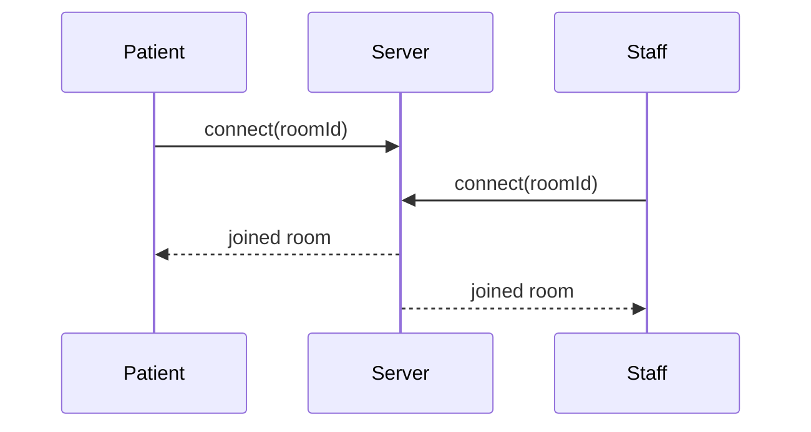
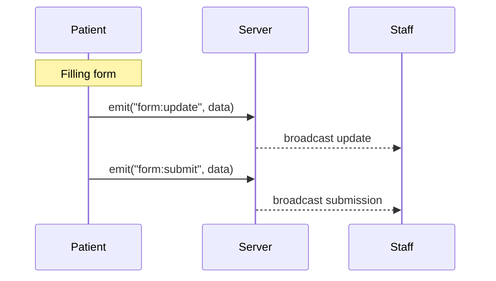
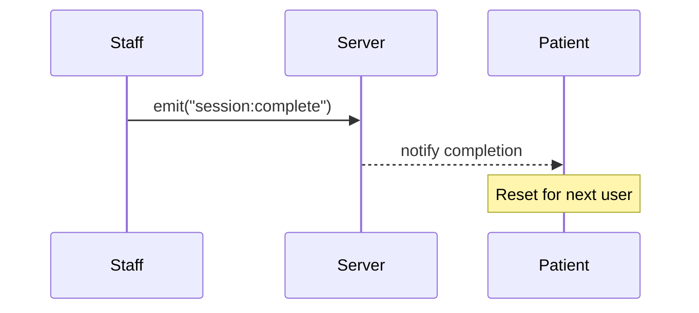

# 🔄 Real-Time Synchronization Flow

## Overview

Both patient and staff clients establish a WebSocket connection to the backend server and join a specific room. Each room represents a shared session between a patient and staff.

All updates are handled through event-based communication, allowing data to be sent and received instantly between both sides.

## 1. Room Connection Flow

### Explanation

- Both patient and staff connect to the same room using a shared `roomId`
- The room acts as a communication channel for that session
- All data is isolated within the room and only shared between the connected users

## 2. Form Update & Submission Flow

### Explanation

- While filling the form → `form:update` events are sent in real time
- When submitting → a `form:submit` event is emitted
- Staff receives and views updates instantly without needing to refresh the page

## 3. Session Completion Flow

### Explanation

- Staff marks the session as completed after finishing the interaction
- The system sends the completion status back to the patient
- The session is reset, allowing the next patient to use the same room without reselecting it

## 🔗 Communication Model

The system follows a **bidirectional communication model**:

- Patient → **Server** → Staff
- Staff → **Server** → Patient

This ensures both sides remain synchronized at all times.

## ⚡ Key Characteristics

- Real-time synchronization without page refresh
- Room-based isolation for independent sessions
- Event-driven architecture using Socket.IO
- Continuous data streaming during form input
- Seamless session reset for consecutive users
